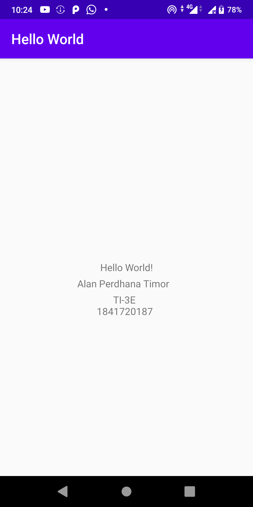

# 01 - Hello World

## Tujuan Pembelajaran

1. Install Android Studio
2. Konfigurasi Software Development Kit (SDK)
3. Konfigurasi Emulator
4. Konfigurasi Device
5. Install Git
6. Konfigurasi Git ke Android Studio
7. Hello World 1

## Hasil Praktikum

