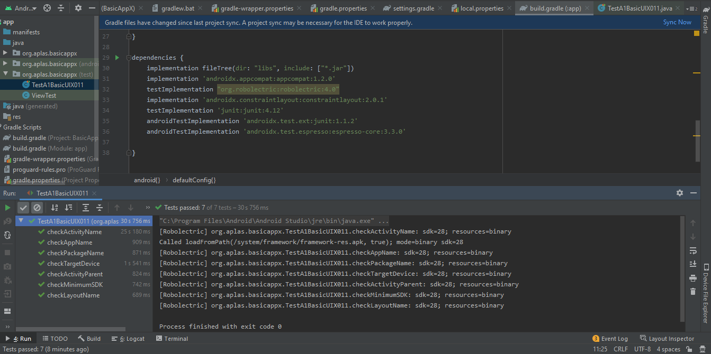
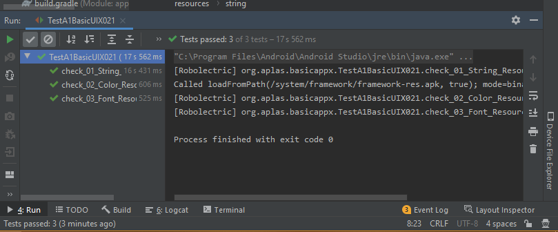
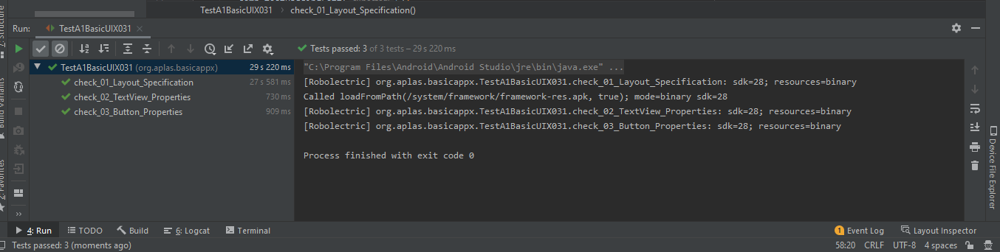
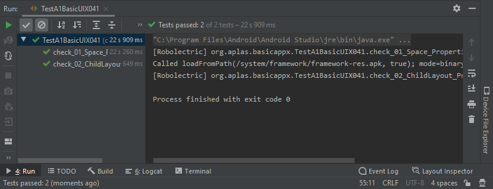
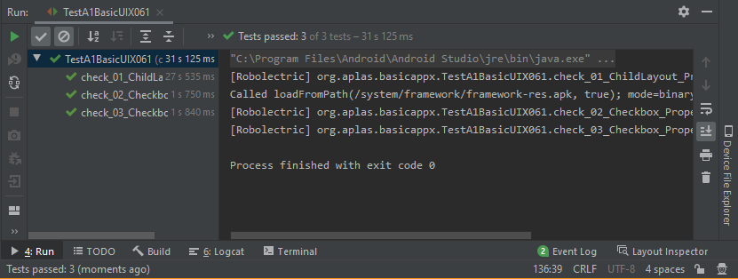
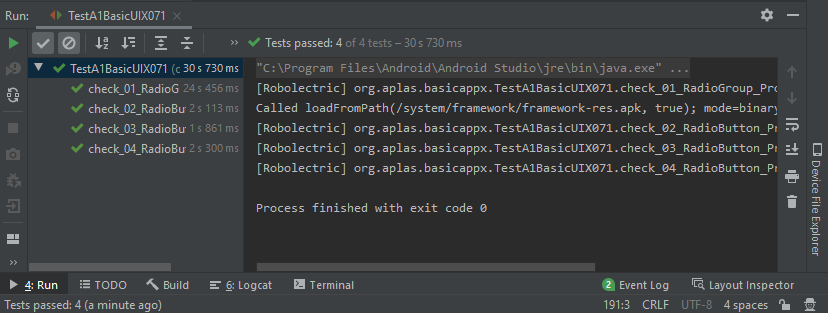
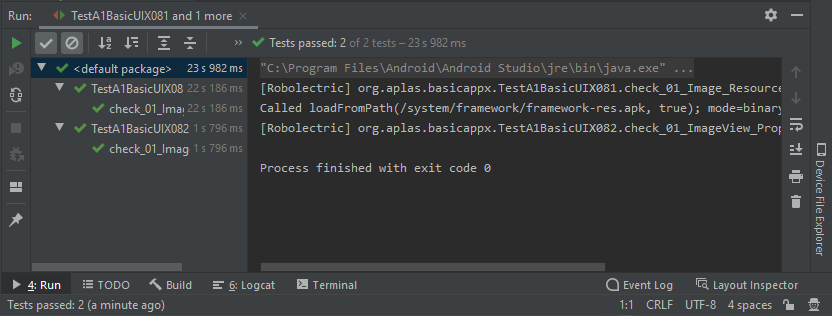
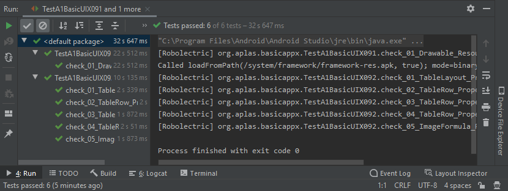

# 02 - Layout

## Tujuan Pembelajaran

1. Students know how to design basic layout, add TextView, and add a Button
2. Students know how to make Space and add Child Layout.
3. Students know how to configure color resources, make EditText, and Spinner
4. Students know how to make CheckBox.
5. Students know how to make RadioGroup and RadioButton.
6. Students know how to add image resource and make an ImageView
7. Students know how to add drawable resource and make a Table
8. Students know how to add image resource and make an ImageView.
9. Students know how to add drawable resource and make a Table.
## Hasil Praktikum

Hasil dari:
1. Students know how to design basic layout, add TextView, and add a Button:

2. Students know how to make Space and add Child Layout:

3. Students know how to configure color resources, make EditText, and Spinner:

4. Students know how to make CheckBox:

5. Students know how to make RadioGroup and RadioButton:

6. Students know how to add image resource and make an ImageView:

7. Students know how to add drawable resource and make a Table:

8. Students know how to add image resource and make an ImageView

9. Students know how to add drawable resource and make a Table.

### Hasil ScreenShoot
1.
* dari tujuan pembelajaran ke -3.

2. Hasil akhir dari pengujian Aplas A1

* Hasil Akhir dari seri A1