# 03 - Basic Activity

## Tujuan Pembelajaran

1. Students create a Temperature class to convert unit.

2. Students create a Distance class to convert unit.

3. Students create a Weight class to convert unit

4. Students can make fields and methods in main activity class

5. Students understand about activity lifecycle when on Create and on Start

6. Students understand about RadioGroup changed event and how to
change Spinner content

7. Students create a method to do conversion

8. Make some events action for Button, Spinner, and CheckBox

9. Students create a new image element and fill it when formula checkbox
checked


   
## Hasil Praktikum

Hasil screenshoot setiap testing yang di coba :


<br/><br/>

## 1. Students create a Temperature class to convert unit.

<br/>

understanding of getter and setter 

using formula :


```java
public void setCelcius(double celcius) {
        this.celcius = celcius;
    }

    public void setFahrenheit(double celcius) {
        this.celcius = (celcius-32)/9*5;
    }

    public void setKelvins(double celcius) {
        this.celcius = celcius-273.15;
    }

    public double getCelcius() {
        return celcius;
    }

    public double getFahrenheit() {
        return celcius*9/5 + 32;
    }

    public double getKelvins() {
        return celcius + 273.15;
    }
```


Testing 1 :

>

<br/> 

## 2. Students create a Distance class to convert unit.

<br/>

understanding of getter and setter

based on formula  :

>

```java
Distance(){
        this.meter = 0;
    }

    public void setMeter(double meter) {
        this.meter = meter;
    }

    public void setInch(double meter){
        this.meter =  meter / 39.3701;
    }

    public void setMile(double meter){
        this.meter =  meter / 0.000621371;
    }

    public void setFoot(double meter){
        this.meter = meter / 3.28084;
    }

    public double getMeter() {
        return meter;
    }

    public double getInch() {
        return meter * 39.3701;
    }

    public double getMile() {
        return meter * 0.000621371;
    }

    public double getFoot() {
        return meter * 3.28084;
    }
```


Testing 2 :

>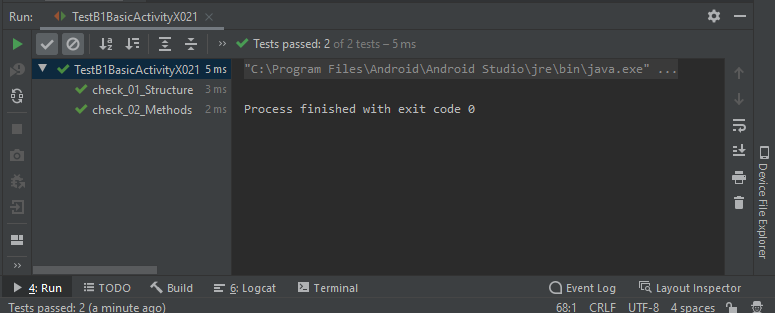

<br/> 

## 3. Students create a Weight class to convert unit

<br/>

understanding of getter and setter

based on formula  :

>

```java
 Weight() {
        this.gram = 0;
    }
    private double gram;

    public void setGram(double gram) {
        this.gram = gram;
    }

    public void setOunce(double gram) {
        this.gram = gram*28.3495231;
    }

    public void setPound(double gram) {
        this.gram = gram*453.59237;
    }

    public double getGram() {
        return gram;
    }

    public double getOunce() {
        return gram/28.3495231;
    }

    public double getPound() {
        return gram/453.59237;
    }
```


Testing 3 :

>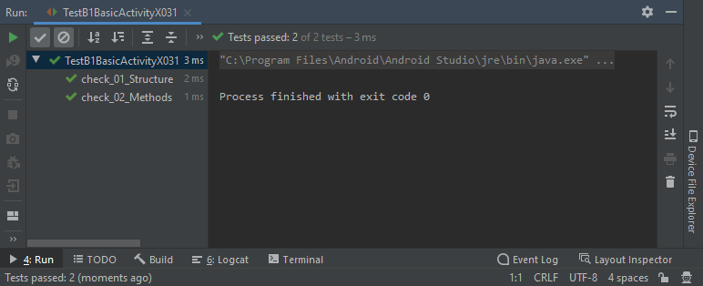

<br/> 

## 4. Students can make fields and methods in main activity class

<br/>

field Requirement :


field code :

```java
    private Distance dist = new Distance(); //as a representative of Distance class
    private Weight weight = new Weight(); //as a representative of weight class
    private Temperature temp = new Temperature(); //as a representative of temperature class
    private Button convertBtn;  //as a button on layout
    private EditText inputTxt;  //as an input text on layout
    private EditText outputTxt; //as an output text on layout
    private Spinner unitOri;    //as a spinner of original value which haven't converted
    private Spinner unitConv;   //as a spinner of conv value which will be converted
    private RadioGroup unitType;//as a chooser which class that will be used for converting value
    private CheckBox roundBox;  //as a checkbox which giving option for showing picture or not
    private ImageView imgView;  //as a representative of image on layout
    private AlertDialog startDialog;    //as an alert dialog when program is started
    private CheckBox formBox; //as an formula viewer
```

Conversion code :

```java
    protected double convertUnit(String sa, String sb, String sc, double da) {
        if (sa.equalsIgnoreCase("Temperature")) {
            return temp.convert(sb, sc, da);
        } else if (sa.equalsIgnoreCase("Distance")) {
            return dist.convert(sb, sc, da);
        } else {
            return weight.convert(sb, sc, da);
        }
    }
```


Testing 4 :

>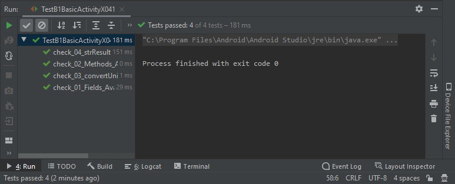


<br/> 

## 5. Students understand about activity lifecycle when on Create and on Start


discribing each element :

```java
    protected void onCreate(Bundle savedInstanceState) {
        super.onCreate(savedInstanceState);
        setContentView(R.layout.activity_main);

        convertBtn = (Button) findViewById(R.id.convertButton);
        inputTxt = (EditText) findViewById(R.id.inputText);
        outputTxt = (EditText) findViewById(R.id.outputText);
        unitOri = (Spinner) findViewById(R.id.oriList);
        unitConv = (Spinner) findViewById(R.id.convList);
        unitType = (RadioGroup) findViewById(R.id.radioGroup);
        roundBox = (CheckBox) findViewById(R.id.chkRounded);
        formBox = (CheckBox) findViewById(R.id.chkFormula);
        imgView = (ImageView) findViewById(R.id.img);
```
Make on start Prompt Dialog :

```java
protected void onStart() {
        super.onStart();

        startDialog = new AlertDialog.Builder(MainActivity.this).create();
        startDialog.setTitle("Application started");
        startDialog.setMessage("This app can use to convert any units");
        startDialog.setButton(AlertDialog.BUTTON_NEUTRAL, "OK",
                new DialogInterface.OnClickListener() {
                    public void onClick(DialogInterface dialog, int which) {
                        dialog.dismiss();
                    }
                });
        startDialog.show();
    }
```


<br/>

Testing 5 :

>

<br/> 

## 6. Students understand about RadioGroup changed event and how to
change Spinner content

<br/>

string requirement:

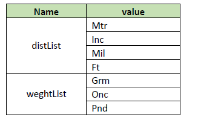

```xml
<string-array
        name="distList">
        <item>Mtr</item>
        <item>Inc</item>
        <item>Mil</item>
        <item>Ft</item>
    </string-array>

    <string-array
        name="weightList">
        <item>Grm</item>
        <item>Onc</item>
        <item>Pnd</item>
    </string-array>
```
create action listerner when radio button changed :

```java
public void onCheckedChanged(RadioGroup group, int checkedId) {
    RadioButton resrab = (RadioButton) findViewById(checkedId);
    ArrayAdapter<CharSequence> arr; //declare Array Adapter
    inputTxt.setText("0");
    outputTxt.setText("0");
    if (resrab.getText().equals("Temperature")) { //get value of radio button which is checked by the user
        arr = ArrayAdapter.createFromResource(unitType.getContext(), R.array.tempList, android.R.layout.simple_spinner_item);// set value of choosen radio group and spinner value
        imgView.setImageResource(R.drawable.temperature);//set image
        imgView.setTag(R.drawable.temperature);//set tag pict
        arr.setDropDownViewResource(android.R.layout.simple_spinner_dropdown_item);//set drop down
        unitOri.setAdapter(arr);
        unitConv.setAdapter(arr);
    
```

Testing 6 :

>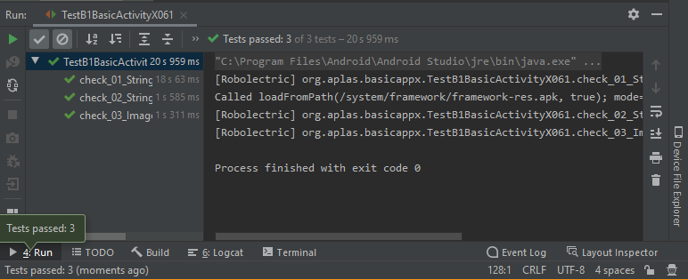

>

<br/> 

## 7. Students create a method to do conversion

<br/>

creating do convert method :

```java
protected void doConvert() {
        double in = Double.parseDouble(inputTxt.getText().toString()); //get text input
        RadioButton rab = (RadioButton) findViewById(unitType.getCheckedRadioButtonId()); //get chekced radio button from radio group and assign to radiobutton "rab"
        double res = convertUnit(rab.getText().toString(), unitOri.getSelectedItem().toString(), unitConv.getSelectedItem().toString(), in);
        outputTxt.setText(strResult(res, roundBox.isChecked())); //calling conver unit with parameter that has been assign top
    }
```


Testing 7 :

>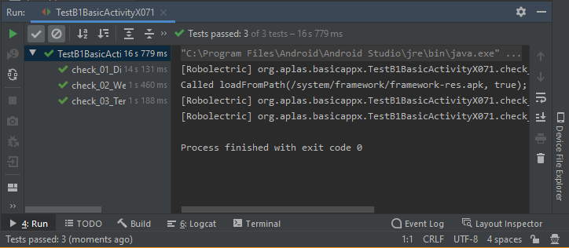

<br/> 

## 8. Make some events action for Button, Spinner, and CheckBox

<br/>

set function when convert button is clicked :

```java
convertBtn.setOnClickListener(new View.OnClickListener() {
            @Override
            public void onClick(View v) {
                doConvert();
            }
        });
```

set action listener when unitori, unitconv, and convlist change :

```java
unitOri.setOnItemSelectedListener(new AdapterView.OnItemSelectedListener() {
            @Override
            public void onItemSelected(AdapterView<?> parent, View view, int position, long id) {
                doConvert();
            }
            @Override
            public void onNothingSelected(AdapterView<?> parent) {
                return;
            }
        });
```
Testing 8 :

>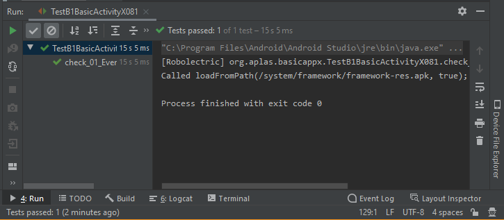

<br/> <br/> <br/>
<br/> <br/> <br/>

## 9.Students create a new image element and fill it when formula checkbox checked

<br/>

create method to set visibility of image on main_activity.xml when checkbox is changed

```java
 formBox.setOnCheckedChangeListener(new CompoundButton.OnCheckedChangeListener() {
            @Override
            public void onCheckedChanged(CompoundButton buttonView, boolean isChecked) {
                ((ImageView)findViewById(R.id.imgFormula)).setVisibility((isChecked)?View.VISIBLE:View.INVISIBLE); ;
            }
        });
```

Testing 9 :

>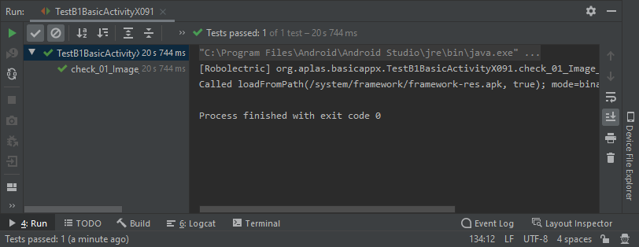

>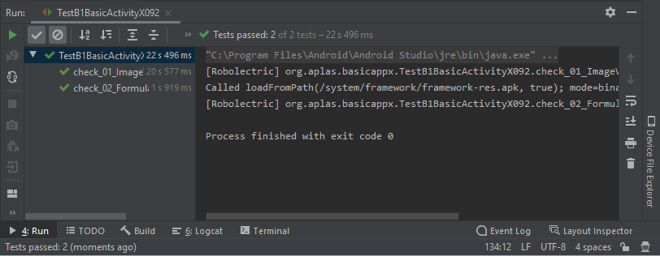

<br>

# Hasil Deploy :

>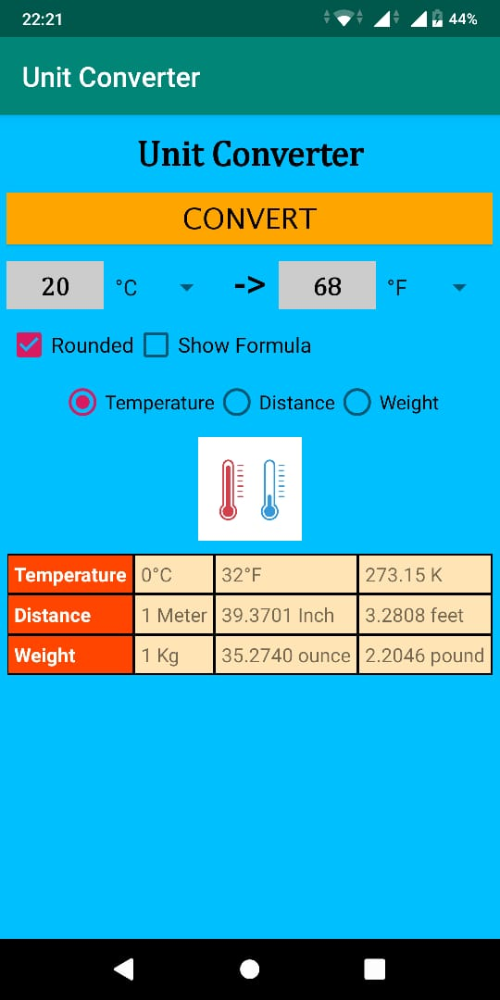

>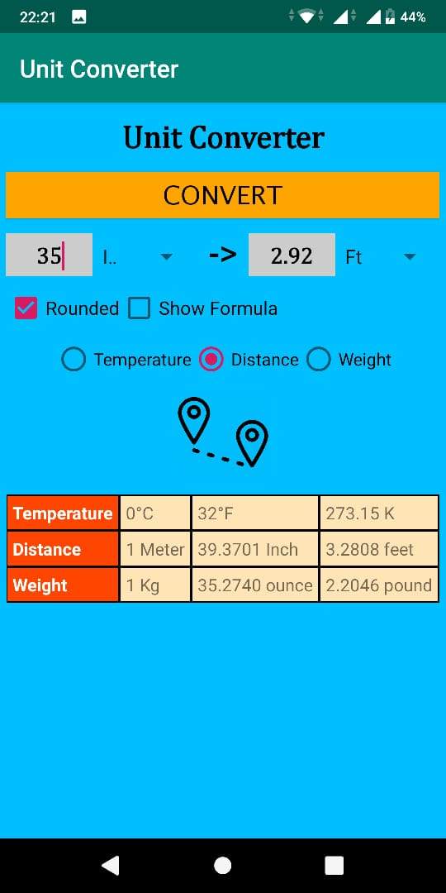

>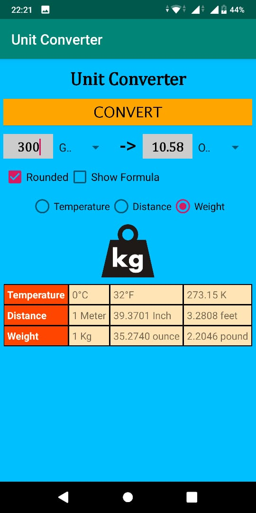

>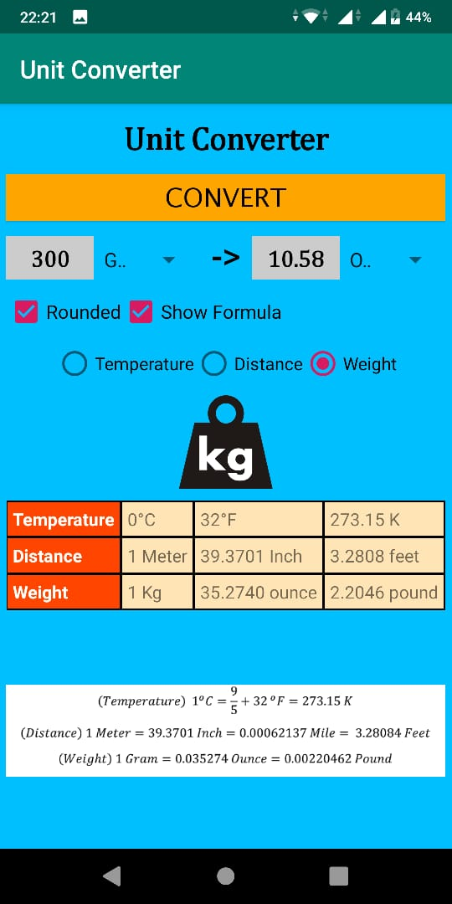


