# 03 - Basic Activity

## Tujuan Pembelajaran

1. Student will start the project to create simple game Android application.
First with project configuration and resource configuration.
2. Student will understand about style, theme, and drawable vector image.
3. Student will make the UI for project of Color Game with some onClick
attribute.
4. Student will declare fields needed by application and define method to
check validity to enter the game.
5. Student will understand how Countdowntimer works.
6. Student will understand how access array from resource and put it into
List and Hashtable.

7. Student will understand how start the timer to start the game.
8. Student will understand how to handle timer and calculate the scor

   
## Hasil Praktikum

Hasil screenshoot setiap testing yang di coba :


<br/><br/>

## 1. Student will start the project to create simple game Android application.

<br/>

Creating New Project 

Testing 1 :

>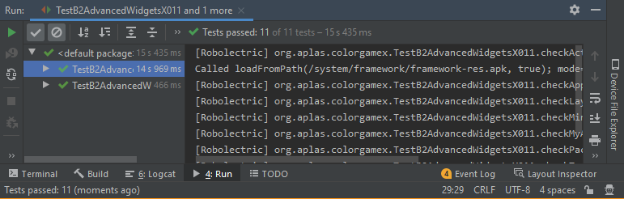

<br/> <br/>

## 2. Student will understand about style, theme, and drawable vector image.

<br/>

Creating Shape Based on formula :

based on formula  :

>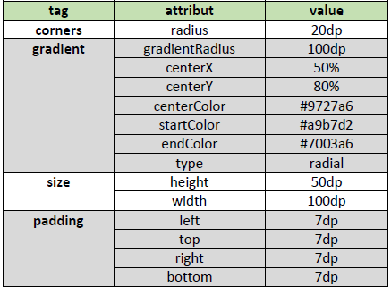

```xml
<shape xmlns:android="http://schemas.android.com/apk/res/android"
    android:shape="rectangle" >

    <corners
        android:radius="20dp"
        />

    <gradient
        android:gradientRadius="100dp"
        android:centerX="50%"
        android:centerY="80%"
        android:centerColor="#9727a6"
        android:startColor="#a9b7d2"
        android:endColor="#7003a6"
        android:type="radial"
        />

    <size
        android:height="50dp"
        android:width="100dp"
        />
    <padding
        android:left="7dp"
        android:top="7dp"
        android:right="7dp"
        android:bottom="7dp"
        />
</shape>
```


Testing 2 :

>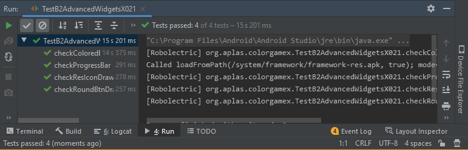

<br/> <br/> 

## 3. Student will make the UI for project of Color Game with some onClick
attribute.

<br/>

Creating a layout so the UI looks like example below :

>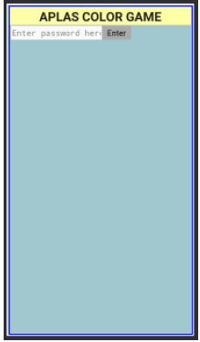


Testing 3 :

>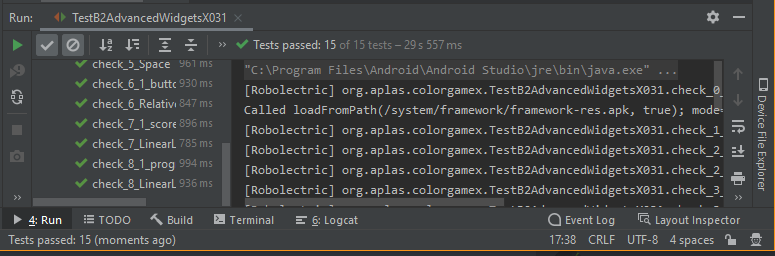

<br/> <br/>

## 4. Student will declare fields needed by application and define method to check validity to enter the game.

<br/>

field Requirement :

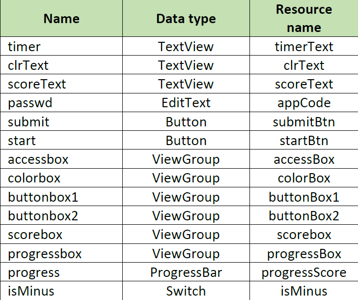

field code :

```java
    TextView timer;
    TextView clrText;
    TextView scoreText;
    EditText passwd;
    Button submit;
    Button start;
    ViewGroup accessbox;
    ViewGroup colorbox;
    ViewGroup buttonbox1;
    ViewGroup buttonbox2;
    ViewGroup scorebox;
    ViewGroup progressbox;
    ProgressBar progress;
    Switch isMinus;
```

Condition code :

```java
    public void openGame(View v) {
        String keyword = getString(R.string.keyword);
        String pass = passwd.getText().toString();
        if (keyword.equals(pass)) {
            passwd.setVisibility(View.INVISIBLE);
            submit.setVisibility(View.INVISIBLE);
            accessbox.setVisibility(View.VISIBLE);
            colorbox.setVisibility(View.VISIBLE);
            buttonbox1.setVisibility(View.VISIBLE);
            buttonbox2.setVisibility(View.VISIBLE);
            scorebox.setVisibility(View.VISIBLE);
            progressbox.setVisibility(View.VISIBLE);
            Toast.makeText(getApplicationContext(), "Login Success", Toast.LENGTH_LONG).show();
        } else {
            passwd.setVisibility(View.VISIBLE);
            submit.setVisibility(View.VISIBLE);
            accessbox.setVisibility(View.VISIBLE);
            colorbox.setVisibility(View.INVISIBLE);
            buttonbox1.setVisibility(View.INVISIBLE);
            buttonbox2.setVisibility(View.INVISIBLE);
            scorebox.setVisibility(View.INVISIBLE);
            progressbox.setVisibility(View.INVISIBLE);
            Toast.makeText(getApplicationContext(), "Password is wrong", Toast.LENGTH_LONG).show();
        }
    }
```


Testing 4 :

>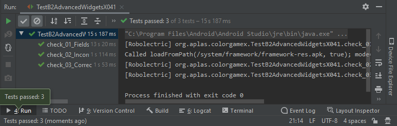


<br/> <br/>

## 5. Student will understand how Countdowntimer works.


Field Requirement :

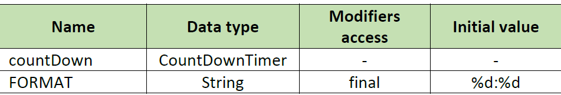

```java
    CountDownTimer countDown;
    final String FORMAT = "%d:%d";
```
create action listerner when radio button changed :

```java
    private void initTimer() {
        countDown = new CountDownTimer(getResources().getInteger(R.integer.maxtimer) * 1000, 1) {
            @Override
            public void onTick(long millisUntilFinished) {
                timer.setText("" + String.format(FORMAT, TimeUnit.MILLISECONDS.toSeconds(millisUntilFinished) - TimeUnit.MINUTES.toSeconds(TimeUnit.MILLISECONDS.toMinutes(millisUntilFinished)), TimeUnit.MILLISECONDS.toMillis(millisUntilFinished) - TimeUnit.SECONDS.toMillis(TimeUnit.MILLISECONDS.toSeconds(millisUntilFinished))));
            }

            @Override
            public void onFinish() {
                wrongSubmit();
            }
        };
    }
    
```


<br/>

Testing 5 :

>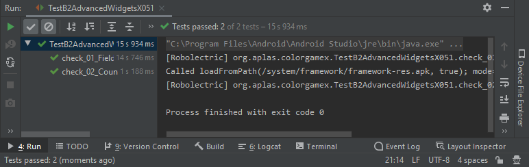

<br/> <br/> 

## 6. Student will understand how access array from resource and put it into
List and Hashtable.

<br/>


Field requirement:

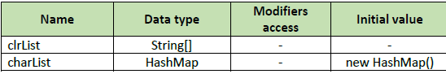

```java
    String[] clrList;
    HashMap charList = new HashMap();
```

example of hasmap usability 

```java
        clrList = getResources().getStringArray(R.array.colorList);
        String[] temp = getResources().getStringArray(R.array.charList);

        for (int i=0; i<clrList.length; i++) {
            charList.put(clrList[i],temp[i]);
        }
```

Testing 6 :

>

<br/> <br/> 

## 7. Student will understand how start the timer to start the game.

<br/>

Field Requirement :
>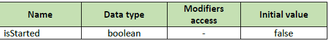

```java
    boolean isStarted = false;
```

used as comparation if the game already start or not 

code usability example :

```java
public void startGame(View v) {
        if (!isStarted) {
            progress.setProgress(0);
            scoreText.setText("0");
            start.setVisibility(View.INVISIBLE);
            isStarted = true;
            newGameStage();
        }
    }

    public void submitColor(View v) {
        if(isStarted){
            String charCode = ((Button)v).getText().toString();
            if (charCode.equals(charList.get(clrText.getText().toString()))) {
                correctSubmit();
            } else {
                wrongSubmit();
            }
        }
    }

    private void correctSubmit() {
        int newScore = progress.getProgress()+getResources().getInteger(R.integer.counter);
        updateScore(newScore);
        if(progress.getProgress()==getResources().getInteger(R.integer.maxScore)){
            countDown.cancel();
            timer.setText("COMPLETE");
            isStarted=false;
            start.setVisibility(View.VISIBLE);
        }else{
            newGameStage();
        }
    }
```


Testing 7 :

>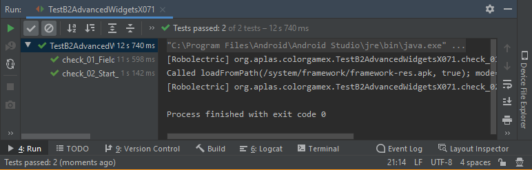

<br/> <br/> 

## 8. Student will understand how to handle timer and calculate the scor
<br/>

create scoring based on this code :

```java
    private void updateScore(int score) {
        progress.setProgress(score);
        scoreText.setText(Integer.toString(score));
    }
```

correct or wrong answer :

```java
    private void correctSubmit() {
        int newScore = progress.getProgress()+getResources().getInteger(R.integer.counter);
        updateScore(newScore);
        if(progress.getProgress()==getResources().getInteger(R.integer.maxScore)){
            countDown.cancel();
            timer.setText("COMPLETE");
            isStarted=false;
            start.setVisibility(View.VISIBLE);
        }else{
            newGameStage();
        }
    }
    private void wrongSubmit() {
        if (isMinus.isChecked() && progress.getProgress()>0) {
            updateScore(progress.getProgress()-getResources().getInteger(R.integer.counter));
        }
        newGameStage();
    }
```


Testing 8 :

>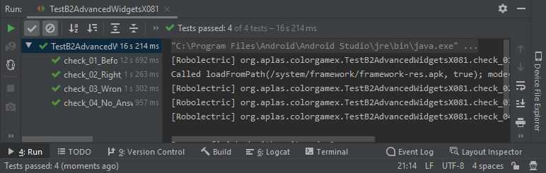

## Hasil Deploy :

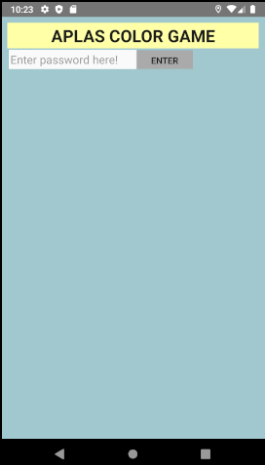

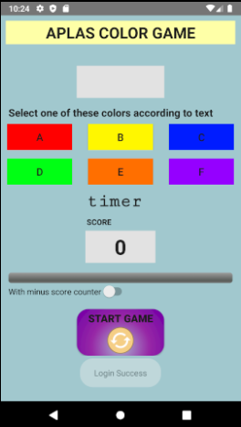

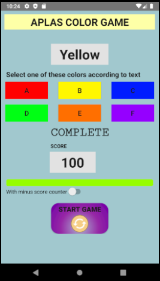

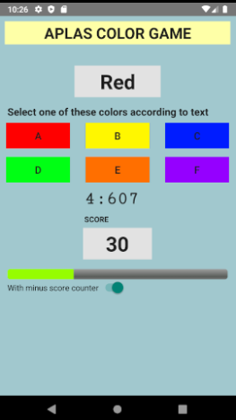


