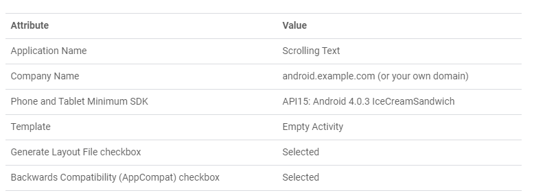
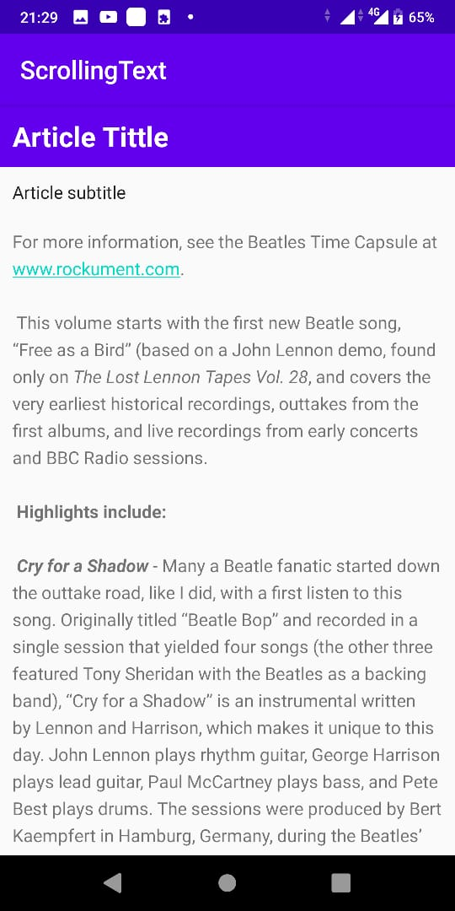
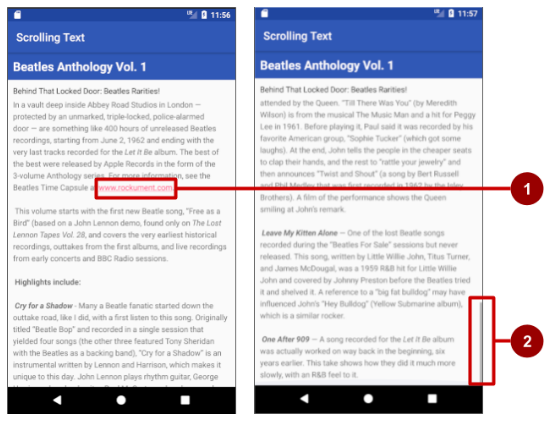
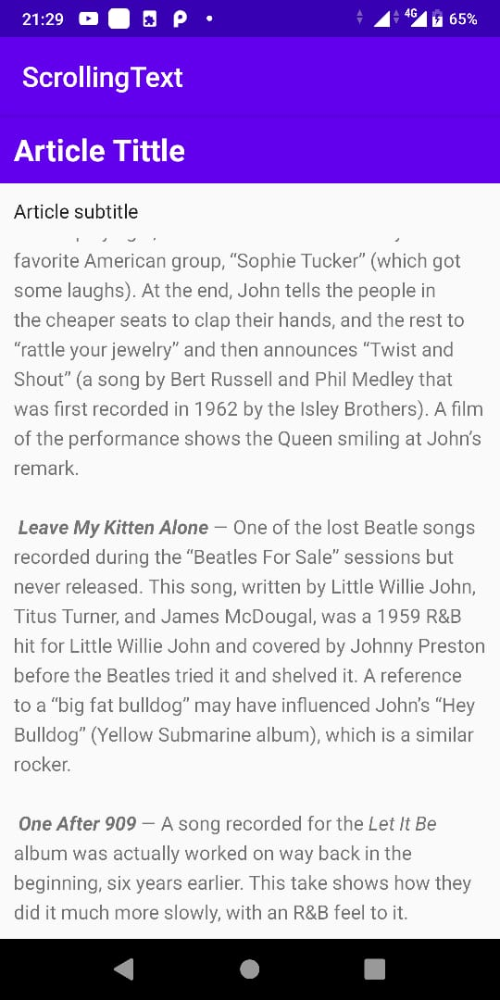
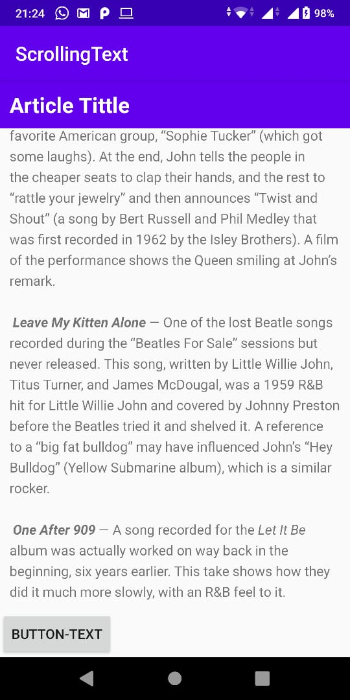
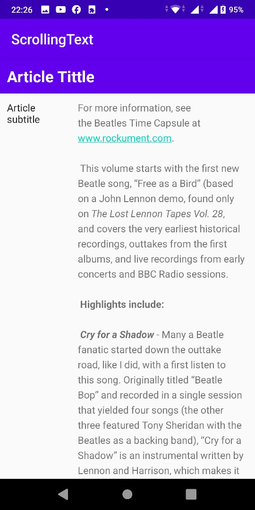

# 05 - scrollview

## Tujuan Pembelajaran

1. Student will Add and edit TextView elements.
First with project configuration and resource configuration.
2. Student will Add a ScrollView and an active web link.
3. Student will understarnd Scroll multiple elements
attribute.
4. Add another UI element—a Button—to the LinearLayout inside the ScrollView so that it scrolls with the text.
5. Change the subheading so that it wraps within a column on the left that is 100 dp wide, as shown below.
Place the text of the article to the right of the subheading as shown below.


   
## Hasil Praktikum

Hasil screenshoot setiap testing yang di coba :


<br/><br/>

## 1. Student will Add and edit TextView elements First with project configuration and resource configuration.

<br/>

1.1 Create the project and TextView elements
In this task you will create the project and the TextView elements, and use TextView attributes for styling the text and background.


>

```xml
<?xml version="1.0" encoding="utf-8"?>
<RelativeLayout xmlns:android="http://schemas.android.com/apk/res/android"
   xmlns:tools="http://schemas.android.com/tools"
   android:layout_width="match_parent"
   android:layout_height="match_parent"
   tools:context="com.example.android.scrollingtext.MainActivity">

   <TextView
      android:layout_width="match_parent"
      android:layout_height="wrap_content"
      android:id="@+id/article_heading"
      android:background="@color/colorPrimary"
      android:padding="@dimen/padding_regular"
      android:text="@string/article_title"
      android:textAppearance=
                  "@android:style/TextAppearance.DeviceDefault.Large"
      android:textColor="@android:color/white"
      android:textStyle="bold" />

   <TextView
      android:layout_width="match_parent"
      android:layout_height="wrap_content"
      android:id="@+id/article_subheading"
      android:layout_below="@id/article_heading"
      android:padding="@dimen/padding_regular"
      android:text="@string/article_subtitle"
      android:textAppearance=
                  "@android:style/TextAppearance.DeviceDefault" />

   <TextView
      android:layout_width="wrap_content"
      android:layout_height="wrap_content"
      android:id="@+id/article"
      android:layout_below="@id/article_subheading"
      android:lineSpacingExtra="@dimen/line_spacing"
      android:padding="@dimen/padding_regular"
      android:text="@string/article_text" />

</RelativeLayout>
```

1.2 Add the text of the article
In a real app that accesses magazine or newspaper articles, the articles that appear would probably come from an online source through a content provider, or might be saved in advance in a database on the device.

```xml
<resources>
    <string name="app_name">ScrollingText</string>
    <string name="article_tittle">Article Tittle</string>
    <string name="article_subtitle">Article subtitle</string>
    <string name="article_text">For more information, see the Beatles Time Capsule at www.rockument.com.
\n\n
This volume starts with the first new Beatle song, “Free as a Bird” (based on a John Lennon demo, found only on <i>The Lost Lennon Tapes Vol. 28</i>, and covers the very earliest historical recordings, outtakes from the first albums, and live recordings from early concerts and BBC Radio sessions.
\n\n
<b>Highlights include:</b>
\n\n
<b><i>Cry for a Shadow</i></b> - Many a Beatle fanatic started down the outtake road, like I did, with a first listen to this song. Originally titled “Beatle Bop” and recorded in a single session that yielded four songs (the other three featured Tony Sheridan with the Beatles as a backing band), “Cry for a Shadow” is an instrumental written by Lennon and Harrison, which makes it unique to this day. John Lennon plays rhythm guitar, George Harrison plays lead guitar, Paul McCartney plays bass, and Pete Best plays drums. The sessions were produced by Bert Kaempfert in Hamburg, Germany, during the Beatles’ second visit from April through July of 1961 to play in the Reeperbahn-section clubs.
\n\n
<b><i>My Bonnie</i></b> and <b><i>Ain’t She Sweet</i></b> — At the same session, the Beatles played on “My Bonnie” (the first-ever single with Beatles playing), as the backing band for English singer Tony Sheridan, originally a member of the Jets. The popularity of this single in Liverpool brought the Beatles to the attention of Brian Epstein, who worked in the NEMS record store and tried to meet demand for the disc. John Lennon then sings a fine “Ain’t She Sweet” (his first-ever released vocal).
\n\n
<b><i>Searchin</i></b> — A Jerry Leiber - Mike Stoller comedy song that was a hit for the Coasters in 1957, and a popular live favorite of the Beatles. The Coasters also had a hit with “Besame Mucho” and the Beatles covered that song as well. Ringo Starr had by now replaced Pete Best on drums. The high falsetto is George, who also plays a hesitant lead guitar. This is from their first audition for Decca Records in London on Jan 1., 1962, live in the studio. The Grateful Dead would later cover “Searchin” with a similar arrangement, Pigpen doing the Paul vocals. A live version is available on outtake records featuring the Dead joined by the Beach Boys!
\n\n
<b><i>Love Me Do</i></b> — An early version of the song, played a bit slower and with more of a blues feeling, and a cool bossa-nova beat in middle. Paul had to sing while John played harmonica — a first for the group. Pete Best played drums on this version.
\n\n
<b><i>She Loves You – Till There Was You – Twist and Shout</i></b> — Live at the Princess Wales Theatre by Leicester Square in London, attended by the Queen. “Till There Was You” (by Meredith Wilson) is from the musical The Music Man and a hit for Peggy Lee in 1961. Before playing it, Paul said it was recorded by his favorite American group, “Sophie Tucker” (which got some laughs). At the end, John tells the people in the cheaper seats to clap their hands, and the rest to “rattle your jewelry” and then announces “Twist and Shout” (a song by Bert Russell and Phil Medley that was first recorded in 1962 by the Isley Brothers). A film of the performance shows the Queen smiling at John’s remark.
\n\n
<b><i>Leave My Kitten Alone</i></b> — One of the lost Beatle songs recorded during the “Beatles For Sale” sessions but never released. This song, written by Little Willie John, Titus Turner, and James McDougal, was a 1959 R&amp;B hit for Little Willie John and covered by Johnny Preston before the Beatles tried it and shelved it. A reference to a “big fat bulldog” may have influenced John’s “Hey Bulldog” (Yellow Submarine album), which is a similar rocker.
\n\n
<b><i>One After 909</i></b> — A song recorded for the <i>Let It Be</i> album was actually worked on way back in the beginning, six years earlier. This take shows how they did it much more slowly, with an R&amp;B feel to it.
</string>
    <string name="add_comment">button-text</string>
</resources>

```

1.3 Run the app
Run the app. The article appears, but the user can't scroll the article because you haven't yet included a ScrollView (which you will do in the next task). Note also that tapping a web link does not currently do anything. You will also fix that in the next task.

>

<br/> <br/>

## 2. Student will Add a ScrollView and an active web link.

<br/>

2.1 Add the autoLink attribute for active web links
Add the android:autoLink="web" attribute to the article TextView. The XML code for this TextView

```xml
<TextView
        android:layout_width="wrap_content"
        android:layout_height="wrap_content"
        android:id="@+id/article"
        android:autoLink="web"
        android:layout_below="@id/article_subheading"
        android:lineSpacingExtra="@dimen/line_spacing"
        android:padding="@dimen/padding_regular"
        android:text="@string/article_text" />
```

2.2 Add a ScrollView to the layout
To make a View (such as a TextView) scrollable, embed the View inside a ScrollView.

```xml
<TextView
   android:layout_width="match_parent"
   android:layout_height="wrap_content"
   android:id="@+id/article_subheading"
   android:layout_below="@id/article_heading"
   android:padding="@dimen/padding_regular"
   android:text="@string/article_subtitle"
        android:textAppearance=
                     "@android:style/TextAppearance.DeviceDefault"/>

<ScrollView
   android:layout_width="wrap_content"
   android:layout_height="wrap_content"></ScrollView>

<TextView
        android:layout_width="wrap_content"
        android:layout_height="wrap_content"
        android:id="@+id/article"
        android:autoLink="web"
        android:layout_below="@id/article_subheading"
        android:lineSpacingExtra="@dimen/line_spacing"
        android:padding="@dimen/padding_regular"
        android:text="@string/article_text" />
```

2.3 Run the app
To examine how the text scrolls:

Run the app on a device or emulator.
Swipe up and down to scroll the article. The scroll bar appears in the right margin as you scroll.

Tap the web link to go to the web page. The android:autoLink attribute turns any recognizable URL in the TextView (such as www.rockument.com) into a web link.

Rotate your device or emulator while running the app. Notice how the scrolling view widens to use the full display and still scrolls properly.
Run the app on a tablet or tablet emulator. Notice how the scrolling view widens to use the full display and still scrolls properly.







<br><br>

## 3. Student will understarnd Scroll multiple elements attribute


<br/>

Creating a layout so the UI looks like example below :

>


Testing 3 :

3.1 Add a LinearLayout to the ScrollView
Open the activity_main.xml file of the ScrollingText app project, and select the Text tab to edit the XML code (if it is not already selected).

```xml
<ScrollView
        android:layout_width="wrap_content"
        android:layout_height="wrap_content"
        android:layout_below="@id/article_subheading">

        <LinearLayout
            android:layout_width="match_parent"
            android:layout_height="wrap_content"
            android:orientation="vertical">

            <TextView
                android:id="@+id/article"
                android:layout_width="wrap_content"
                android:layout_height="wrap_content"
                android:autoLink="web"
                android:lineSpacingExtra="@dimen/line_spacing"
                android:padding="@dimen/padding_regular"
                android:text="@string/article_text" />
        </LinearLayout>

</ScrollView>
```

3.2 Move UI elements within the LinearLayout
The LinearLayout now has only one UI element—the article TextView. You want to include the article_subheading TextView in the LinearLayout so that both will scroll.

```xml
<ScrollView
        android:layout_width="wrap_content"
        android:layout_height="wrap_content"
        android:layout_below="@id/article_heading">

        <LinearLayout
            android:layout_width="match_parent"
            android:layout_height="wrap_content"
            android:orientation="vertical">

            <TextView
                android:id="@+id/article_subheading"
                android:layout_width="match_parent"
                android:layout_height="wrap_content"
                android:padding="@dimen/padding_regular"
                android:text="@string/article_subtitle"
                android:textAppearance=
                     "@android:style/TextAppearance.DeviceDefault" />

            <TextView
                android:id="@+id/article"
                android:layout_width="wrap_content"
                android:layout_height="wrap_content"
                android:autoLink="web"
                android:lineSpacingExtra="@dimen/line_spacing"
                android:padding="@dimen/padding_regular"
                android:text="@string/article_text" />
        </LinearLayout>

</ScrollView>
```


### Hasil

>
>

<br/> <br/>

## 4. Add another UI element—a Button—to the LinearLayout inside the ScrollView so that it scrolls with the text.

<br/>

Challenge: Add another UI element—a Button—to the LinearLayout inside the ScrollView so that it scrolls with the text.

Make the Button appear below the article. The user scrolls to the end of the article to see the Button.
Use the text Add Comment for the Button. For this challenge, there is no need to create a button-handling method; all you have to do is put the Button element in the proper place in the layout.

```xml
<Button
                android:layout_width="wrap_content"
                android:layout_height="wrap_content"
                android:id="@+id/comment_button"
                android:text="@string/add_comment"/>
```




<br/> <br/>

## 5. Change an app Open the ScrollingText2 app that you created in the Working with TextView Elements lesson.

```xml
<?xml version="1.0" encoding="utf-8"?>
<RelativeLayout xmlns:android="http://schemas.android.com/apk/res/android"
    xmlns:tools="http://schemas.android.com/tools"
    android:layout_width="match_parent"
    android:layout_height="match_parent"
    tools:context=".MainActivity">

    <TextView
        android:id="@+id/article_heading"
        android:layout_width="match_parent"
        android:layout_height="wrap_content"
        android:background="@color/colorPrimary"
        android:padding="@dimen/padding_regular"
        android:text="@string/article_tittle"
        android:textAppearance="@android:style/TextAppearance.DeviceDefault.Large"
        android:textColor="@android:color/white"
        android:textStyle="bold" />

    <LinearLayout
        android:layout_width="match_parent"
        android:layout_height="wrap_content"
        android:orientation="horizontal"
        android:layout_below="@id/article_heading">

    <TextView
        android:id="@+id/article_subheading"
        android:layout_width="100dp"
        android:layout_height="match_parent"
        android:padding="@dimen/padding_regular"
        android:text="@string/article_subtitle"
        android:textAppearance="@android:style/TextAppearance.DeviceDefault" />

    <ScrollView
        android:layout_width="wrap_content"
        android:layout_height="wrap_content"
        android:layout_below="@id/article_heading">

        <LinearLayout
            android:layout_width="match_parent"
            android:layout_height="wrap_content"
            android:orientation="vertical">


            <TextView
                android:id="@+id/article"
                android:layout_width="wrap_content"
                android:layout_height="wrap_content"
                android:autoLink="web"
                android:lineSpacingExtra="@dimen/line_spacing"
                android:padding="@dimen/padding_regular"
                android:text="@string/article_text" />

            <Button
                android:layout_width="wrap_content"
                android:layout_height="wrap_content"
                android:id="@+id/comment_button"
                android:text="@string/add_comment"/>
        </LinearLayout>
    </ScrollView>
    </LinearLayout>
</RelativeLayout>
```
<br>



