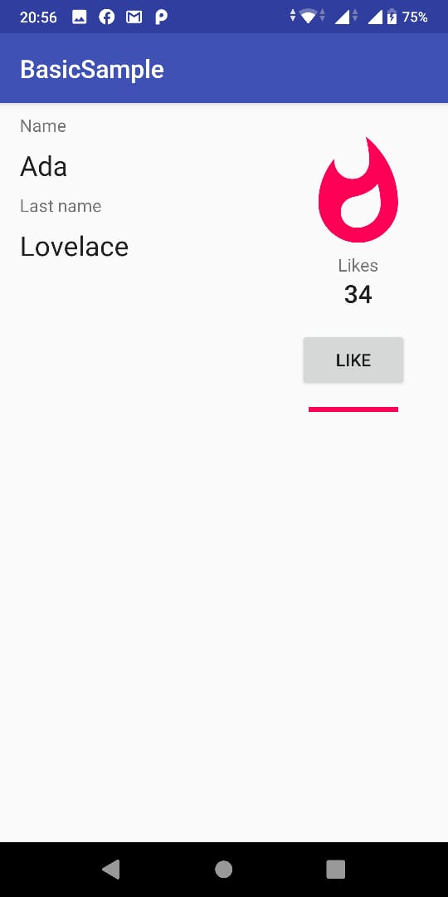
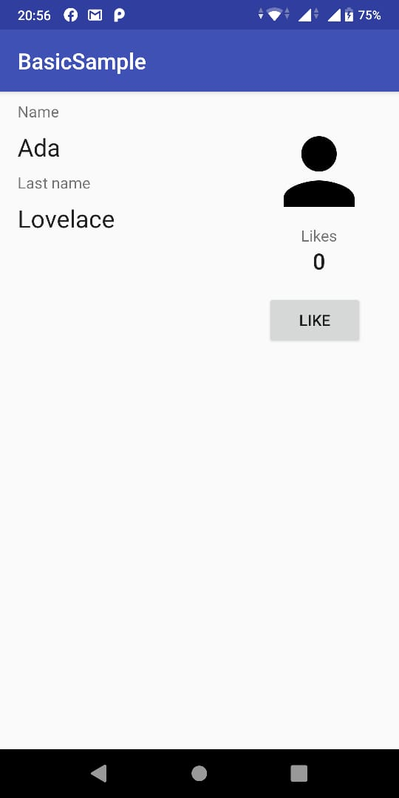
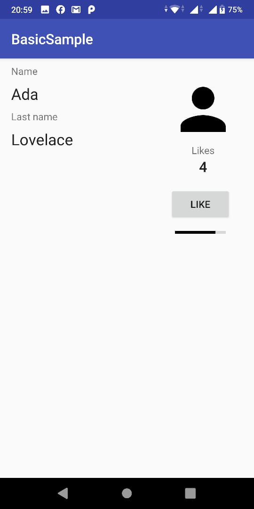
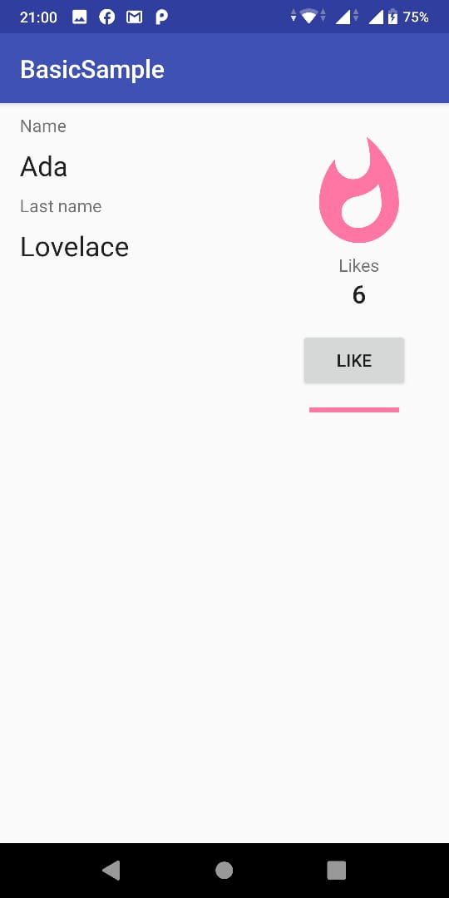

# 07 - Input Controls

## Tujuan Pembelajaran

1. Try out the app without Data Binding
2. Enable Data Binding and convert the layout
3. Create your first layout expression
4. Change inflation and remove UI calls from activity
5. Dealing with user events
6. Observing data
7. Using Binding Adapters to create custom attributes
8. Create a Binding Adapter with multiple parameters
9. Practice creating Binding Adapters

## Hasil Praktikum

1. Try out the app without Data Binding

The SimpleViewModel class exposes:
 - First and last name    
 - Number of likes
 - A value describing level of popularity

SimpleViewModel also lets the user increment the number of likes with the onLike() method.

While it doesn't have the most interesting functionality, SimpleViewModel is sufficient for this exercise. On the other hand, the UI implementation found in the PlainOldActivity class has a number of problems:


- It calls findViewById() multiple times. Not only is this slow, it's not safe because it's not checked at compile time. If the ID you pass to findViewById() is wrong, the app will crash at run time.

- It sets initial values in onCreate(). It'd be much better to have good defaults that are set automatically

- It uses the android:onClick attribute in the Button element of the XML layout declaration, which is not safe either: If the onLike() method is not implemented in your activity (or is renamed), the app will crash at run time.

- It has a lot of code. 
Activities and fragments tend to grow very quickly, so it's a good idea to move as much code as possible out of them. Also, code in activities and fragments is hard to test and maintain.

With the Data Binding Library you can fix all of these problems by moving logic out of the activity into places where it's reusable and easier to test.

2. Enable Data Binding and convert the layout

This project already has Data Binding enabled, but when you want to use it in your own projects the first step is to enable the library in the modules that will use it:


```xml 
android {
...
    buildFeatures {
       dataBinding true
    }
}
```

Open plain_activity.xml. It is a regular layout with a ConstraintLayout as the root element.

In order to convert the layout to Data Binding, you need to wrap the root element in a <layout> tag. You'll also have to move the namespace definitions (the attributes that start with xmlns:) to the new root element.

Android Studio offers a handy way to do this automatically: Right-click the root element, select Show Context Actions, then Convert to data binding layout:

```xml
<layout xmlns:android="http://schemas.android.com/apk/res/android"
       xmlns:app="http://schemas.android.com/apk/res-auto"
       xmlns:tools="http://schemas.android.com/tools">
   <data>

   </data>
   <androidx.constraintlayout.widget.ConstraintLayout
           android:layout_width="match_parent"
           android:layout_height="match_parent">

       <TextView
...
```

By using layout expressions to bind components in the layout file, you can:

- Improve your app's performance

- Help prevent memory leaks and null pointer exceptions

- Streamline your activity's code by removing UI framework calls

```xml
// Bind the name property of the viewmodel to the text attribute
android:text="@{viewmodel.name}"
// Bind the nameVisible property of the viewmodel to the visibility attribute
android:visibility="@{viewmodel.nameVisible}"
// Call the onLike() method on the viewmodel when the View is clicked.
android:onClick="@{() -> viewmodel.onLike()}"
```

Here are some examples:


3. Create your first layout expression


Let's start with some static data binding for now.

- Create two String layout variables inside the <data> tag.

```xml
<data>
        <variable name="name" type="String"/>
        <variable name="lastName" type="String"/>
    </data>
```

- Look for the TextView with the ID plain_name and add the android:text attribute with a layout expression:

```xml
<TextView
                android:id="@+id/plain_name"
                android:text="@{name}" 
        ... />
```

Layout expressions start with an @ symbol and are wrapped inside curly braces { }.

Because name is a String, Data Binding is going to know how to set that value in the TextView. You'll learn how to deal with different layout expression types and attributes later on.

- Do the same thing with the plain_lastName text view:

```xml

<TextView
                android:id="@+id/plain_lastname"
                android:text="@{lastName}"
        ... />
```


4. Change inflation and remove UI calls from activity

The layout is ready, but now it's necessary to make some changes in the activity. Open PlainOldActivity.

Because you're using a Data Binding layout, the inflation is done in a different way.

In onCreate, replace:

```xml
setContentView(R.layout.plain_activity)
```
with:

```xml
val binding : PlainActivityBinding =
    DataBindingUtil.setContentView(this, R.layout.plain_activity)
```
What is the purpose of this variable? You'll need it to set those layout variables you declared in the <data> block. Binding classes are generated automatically by the library.

To see what a generated class looks like, open PlainActivitySolutionBinding, and take a look around.

- Now you can set the variable values:

```xml
binding.name = "Your name"
    binding.lastName = "Your last name"
```

And that's it. You just bound data using the library.

You can start removing old code:

- Remove the updateName() method, since the new Data Binding code is now finding the IDs and setting the text values.

- Remove the updateName() call in onCreate().

You can find the result of these operations in PlainOldActivitySolution2.

You can now run the app. You'll see that your name has replaced Ada's.


5. Dealing with user events

So far you've learned how to show data to the user, but with the Data Binding Library you can also handle user events and invoke actions on layout variables.

Before modifying the event handling code, you can clean up the layout a bit.

- First, replace the two variables for a single ViewModel. This is the way to go in the majority of cases since it keeps your presentation code and state in one place.

```xml
<data>
        <variable
                name="viewmodel"
                type="com.example.android.databinding.basicsample.data.SimpleViewModel"/>
    </data>
```

Instead of accessing the variables directly, call the viewmodel properties:

- Change the layout expressions in both TextViews:

```xml
<TextView
                android:id="@+id/plain_name"
                android:text="@{viewmodel.name}"
... />
        <TextView
                android:id="@+id/plain_lastname"
                android:text="@{viewmodel.lastName}"
... />
```

Also, update how clicks on the "Like" button are handled.

- Look for the like_button Button and replace

```xml
android:onClick="onLike"
```

```xml
android:onClick="@{() -> viewmodel.onLike()}"
```

The former onClick attribute used an unsafe mechanism in which the onLike() method in the activity or fragment is called when the view is clicked. If a method with that exact signature doesn't exist, the app crashes.

The new way is much safer because it's checked at compile time and uses a lambda expression to call the onLike() method of the view model.


You can find the result of these operations in plain_activity_solution_3.xml.

Now, remove things you don't need from the activity:

1. Replace

```xml
binding.name = "Your name"
    binding.lastName = "Your last name"

```

with

```xml
binding.viewmodel = viewModel
```

2. Remove the onLike() method in the activity, as it's bypassed now.

You can find the result of these operations in PlainOldActivitySolution3.

If you run the app you'll see that the button doesn't do anything. That's because you're not calling updateLikes() anymore. In the next section, you'll learn to implement that properly.


6. Observing data

n the previous step, you created a static binding. If you open the ViewModel you'll find that name and lastName are just Strings, which is fine because they are not going to change. However, likes is modified by the user.

```xml
var likes =  0
```
Instead of explicitly updating the UI when this value changes, make it observable.

There are multiple ways to implement observability. You can use observable classes, observable fields, or, the preferred way, LiveData. The full documentation on that is here.

We're going to use ObservableFields as they are simpler.

Replace
```xml
val name = "Grace"
    val lastName = "Hopper"
    var likes = 0
        private set // This is to prevent external modification of the variable.

```
with the new LiveDatas:

```xml
private val _name = MutableLiveData("Ada")
    private val _lastName = MutableLiveData("Lovelace")
    private val _likes =  MutableLiveData(0)

    val name: LiveData<String> = _name
    val lastName: LiveData<String> = _lastName
    val likes: LiveData<Int> = _likes

```

Also, replace

```xml
fun onLike() {
        likes++
    }

    /**
     * Returns popularity in buckets: [Popularity.NORMAL],
     * [Popularity.POPULAR] or [Popularity.STAR]
     */
    val popularity: Popularity
        get() {
            return when {
                likes > 9 -> Popularity.STAR
                likes > 4 -> Popularity.POPULAR
                else -> Popularity.NORMAL
            }
        }
```
As you can see, a LiveData's value is set with the value property, and you can make one LiveData depend on another using Transformations. This mechanism allows the library to update the UI when the value changes.

LiveData is a lifecycle-aware observable so you need to specify what lifecycle owner to use. You do this in the binding object.

Open PlainOldActivity (it should look like PlainOldActivitySolution3) and set the lifecycle owner in the binding object:

If you rebuild the project you'll find that the activity is not compiling. We're accessing likes directly from the activity, which we don't need anymore:

```xml
private fun updateLikes() {
        findViewById<TextView>(R.id.likes).text = viewModel.likes.toString()
        findViewById<ProgressBar>(R.id.progressBar).progress =
            (viewModel.likes * 100 / 5).coerceAtMost(100)
...
```

Open PlainOldActivity and remove all the private methods in the activity and their calls. The activity is now as simple as it gets.

```xml
class PlainOldActivity : AppCompatActivity() {

    // Obtain ViewModel from ViewModelProviders
    private val viewModel by lazy { ViewModelProviders.of(this).get(SimpleViewModel::class.java) }

    override fun onCreate(savedInstanceState: Bundle?) {
        super.onCreate(savedInstanceState)

        val binding : PlainActivityBinding =
            DataBindingUtil.setContentView(this, R.layout.plain_activity)

        binding.lifecycleOwner = this

        binding.viewmodel = viewModel
    }
}
```

You can find the result of these operations in SolutionActivity.

In general, moving code out of the activity is great for maintainability and testability.

Let's bind the TextView showing the number of likes to the observable integer. In plain_activity.xml:

```xml
<TextView
                android:id="@+id/likes"
                android:text="@{Integer.toString(viewmodel.likes)}"
...
```

Let's recap what's been done so far:

1. Name and last name are exposed as strings from the view model.

2. The button's onClick attribute is bound to the view model via a lambda expression.

3. The number of likes is exposed from the view model via an observable integer and bound to a text view so it's refreshed automatically when it changes.

Thus far, you've used attributes like android:onClick and android:text. In the next section, you'll learn about other properties and create your own.


7. Using Binding Adapters to create custom attributes

When you bind a string (or an observable string) to an android:text attribute it's pretty obvious what's going to happen but how is it happening?

With the Data Binding Library, almost all UI calls are done in static methods called Binding Adapters.

The library provides a huge amount of Binding Adapters. Check them out here. Here's an example for the android:text attribute:

```xml
@BindingAdapter("android:text")
    public static void setText(TextView view, CharSequence text) {
        // Some checks removed for clarity

        view.setText(text);
    }
```

Or the android:background one:

```xml
@BindingAdapter("android:background")
    public static void setBackground(View view, Drawable drawable) {
        if (VERSION.SDK_INT >= VERSION_CODES.JELLY_BEAN) {
            view.setBackground(drawable);
        } else {
            view.setBackgroundDrawable(drawable);
        }
    }
```

There's no magic in Data Binding. Everything is resolved at compilation time and it's accessible for you to read in the generated code.

Let's work on the progress bar. We want it to:

- Be invisible if there are no likes
- Fill up with 5 likes
- Change color if full

We're going to create custom Binding Adapters for this.

Open the BindingAdapters.kt file in the utils package. It doesn't matter where you create them, the library will find them. In Kotlin, static methods can be created by adding functions to the top level of a Kotlin file or as extension functions on the class.

Look for the Binding Adapter for the first requirement, hideIfZero:

```xml
@BindingAdapter("app:hideIfZero")
    fun hideIfZero(view: View, number: Int) {
        view.visibility = if (number == 0) View.GONE else View.VISIBLE
    }
```

This binding adapter:

- applies to the app:hideIfZero attribute.

- can be applied to every View (since the first parameter is a View; you can restrict to certain classes by changing this type)
- takes an Integer that should be what the layout expression returns.
- makes the View GONE if the number is zero. VISIBLE otherwise.

In the plain_activity layout, look for the progress bar and add the hideIfZero attribute:

```xml
<ProgressBar
            android:id="@+id/progressBar"
            app:hideIfZero="@{viewmodel.likes}"
...
```

8. Create a Binding Adapter with multiple parameters

For the progress value, we're going to use a Binding Adapter that takes the maximum value and the number of likes. Open the BindingAdapters file and look for this one:

```xml
/**
 *  Sets the value of the progress bar so that 5 likes will fill it up.
 *
 *  Showcases Binding Adapters with multiple attributes. Note that this adapter is called
 *  whenever any of the attribute changes.
 */
@BindingAdapter(value = ["app:progressScaled", "android:max"], requireAll = true)
fun setProgress(progressBar: ProgressBar, likes: Int, max: Int) {
    progressBar.progress = (likes * max / 5).coerceAtMost(max)
}
```

This Binding Adapter is not used if any of the attributes are missing. This happens at compile time. The method takes 3 parameters now (the view it applies to plus the number of attributes defined in the annotation).

The requireAll parameter defines when the binding adapter is used:

- When true, all elements must be present in the XML definition.
- When false, the missing attributes will be null, false if booleans, or 0 if primitives.
Next, add the attributes to the XML:

```xml
<ProgressBar
                android:id="@+id/progressBar"
                app:hideIfZero="@{viewmodel.likes}"
                app:progressScaled="@{viewmodel.likes}"
                android:max="@{100}"
...
```

We're binding the progressScaled attribute to the number of likes and we're just passing a literal integer to the max attribute. If you don't add the @{} format, Data Binding won't be able to find the correct Binding Adapter.

You can find the result of these steps in plain_activity_solution_5.xml.

If you run the app, you'll see how the progress bar fills up as expected.

9. Practice creating Binding Adapters

Practice makes perfect. Create:

- a Binding Adapter that tints the color of the progress bar depending on the value of likes and adds the corresponding attribute
- a Binding Adapter that shows a different icon depending on the popularity:

- - ic_person_black_96dp in black

- - ic_whatshot_black_96dp in light pink

- - ic_whatshot_black_96dp in bold pink

You'll find solutions in the BindingAdapters.kt file, the SolutionActivity file, and the solution.xml layout.

## Hasil run program:

>

>

>

>
