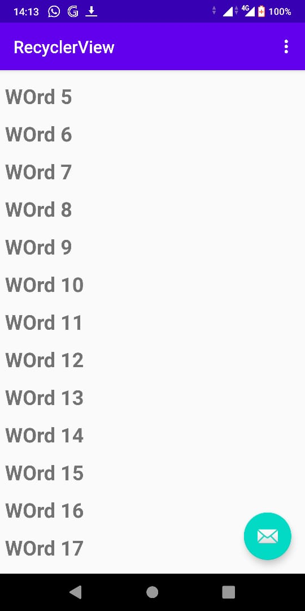
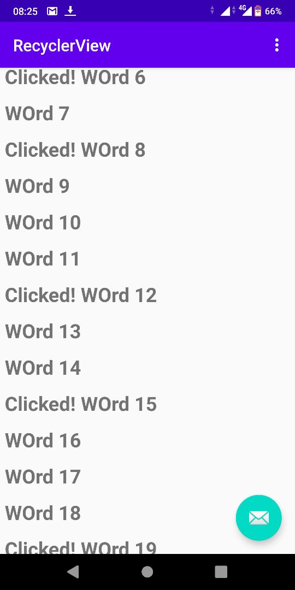

# 13 - Data Binding

## Tujuan Pembelajaran

1. How to use the RecyclerView class to display items in a scrollable list.
2. How to dynamically add items to the RecyclerView as they become visible through scrolling.
3. How to perform an action when the user taps a specific item.
4. How to show a FAB and perform an action when the user taps it.boilerplate code.

## Hasil Praktikum

1. Create the project and layout

    - Start Android Studio.

    - Create a new project with the name RecyclerView, select the Basic Activity template, and generate the layout file.

    - Run your app. You should see the RecyclerView app title and "Hello World" on the screen.


2. Add code to create data

    - Open MainActivity and add a private member variable for the mWordList linked list.
        
        `````
            public class MainActivity extends AppCompatActivity {
                private final LinkedList<String> mWordList = new LinkedList<>();
                // ... Rest of MainActivity code ...
            }
        ``````
    - Add code within the onCreate() method that populates mWordList with words:

        `````
            // Put initial data into the word list.
            for (int i = 0; i < 20; i++) {
                mWordList.addLast("Word " + i);
            }
        ``````


3. Change the FAB icon

    -  Expand res in the Project > Android pane, and right-click (or Control-click) the drawable folder.

    -  Choose New > Image Asset. The Configure Image Asset dialog appears.

    -  Choose Action Bar and Tab Items in the drop-down menu at the top of the dialog.

    -  Change ic_action_name in the Name field to ic_add_for_fab.

    -  Click the clip art image (the Android logo next to Clipart:) to select a clip art image as the icon. A page of icons appears. Click the icon you want to use for the FAB, such as the plus (+) sign.

    -  Choose HOLO_DARK from the Theme drop-down menu. This sets the icon to be white against a dark-colored (or black) background. Click Next.

    -  Click Finish in the Confirm Icon Path dialog.


4. Modify the layout in content_main.xml

    - Open content_main.xml in your RecyclerView app. It shows a "Hello World" TextView at the center of a ConstraintLayout.

    - Click the Text tab to show the XML code.

    - Replace the entire TextView element with the following:

        `````
            <android.support.v7.widget.RecyclerView
                android:id="@+id/recyclerview"
                android:layout_width="match_parent"
                android:layout_height="match_parent">
            </android.support.v7.widget.RecyclerView>
        ``````


5. Observing data

    - Right-click the app > res > layout folder and choose New > Layout resource file.

    - Name the file wordlist_item and click OK.

    - In the new layout file, click the Text tab to show the XML code.

    - Change the ConstraintLayout that was created with the file to a LinearLayout with the following attributes (extract resources as you go):

        `````
            <LinearLayout xmlns:android="http://schemas.android.com/apk/res/android"
                android:layout_width="match_parent"
                android:layout_height="wrap_content"
                android:orientation="vertical"
                android:padding="6dp">

            </LinearLayout>
        ``````

    - Change the ConstraintLayout that was created with the file to a LinearLayout with the following attributes (extract resources as you go):

        `````
            <TextView
                android:id="@+id/word"
                android:layout_width = "match_parent"
                android:layout_height = "wrap_content"
                android:textSize = "24sp"
                android:textStyle = "bold"
            />
        ``````


6. Create a style from the TextView attributes

    - Open wordlist_item.xml if it is not already open.

    - Right-click (or Control-click) the TextView you just created in wordlist_item.xml, and choose Refactor > Extract > Style. The Extract Android Style dialog appears.

    - Name your style word_title and leave all other options selected. Select the Launch ‘Use Style Where Possible' option. Then click OK.

    - When prompted, apply the style to the Whole Project.

    - Find and examine the word_title style in values > styles.xml.

    - Reopen wordlist_item.xml if it is not already open. The TextView now uses the style in place of individual styling properties, as shown below.

        `````
            <?xml version="1.0" encoding="utf-8"?>
            <LinearLayout xmlns:android="http://schemas.android.com/apk/res/android"
                android:layout_width="match_parent"
                android:layout_height="wrap_content"
                android:orientation="vertical"
                android:padding="6dp">

                <TextView
                    android:id="@+id/word"
                    style="@style/word_title" />

            </LinearLayout>
        ``````
    

7. Create an adapter

    - Right-click java/com.android.example.recyclerview and select New > Java Class.

    - Name the class WordListAdapter.

    - Give WordListAdapter the following signature:

        `````
            public class WordListAdapter extends
                RecyclerView.Adapter<WordListAdapter.WordViewHolder>  {}
        ``````


8. Create the ViewHolder for the adapter

    - Inside the WordListAdapter class, add a new WordViewHolder inner class with this signature:

        `````
            class WordViewHolder extends RecyclerView.ViewHolder {}
        ``````

    - Add variables to the WordViewHolder inner class for the TextView and the adapter:

        `````
            public final TextView wordItemView;
            final WordListAdapter mAdapter;
        ``````

    - In the inner class WordViewHolder, add a constructor that initializes the ViewHolder TextView from the word XML resource, and sets its adapter:

        `````
            public WordViewHolder(View itemView, WordListAdapter adapter) {
                super(itemView);
                wordItemView = itemView.findViewById(R.id.word);
                this.mAdapter = adapter;
            }
        ``````

    - Run your app to make sure that you have no errors. Your will still see only a blank view.

    - Click the Logcat tab to see the Logcat pane, and note the E/RecyclerView: No adapter attached; skipping layout warning. You will attach the adapter to the RecyclerView in another step.


9. Storing your data in the adapter

    - To hold your data in the adapter, create a private linked list of strings in WordListAdapter and call it mWordList.

    - You can now fill in the getItemCount() method to return the size of mWordList:

        `````
            @Override
            public int getItemCount() {
                return mWordList.size();
            }
        ``````

    - WordListAdapter needs a constructor that initializes the word list from the data. To create a View for a list item, the WordListAdapter needs to inflate the XML for a list item. You use a layout inflator for that job. LayoutInflator reads a layout XML description and converts it into the corresponding View items. Start by creating a member variable for the inflater in WordListAdapter:

        `````
            private LayoutInflater mInflater;
        ``````

    - Implement the constructor for WordListAdapter. The constructor needs to have a context parameter, and a linked list of words with the app's data. The method needs to instantiate a LayoutInflator for mInflater and set mWordList to the passed in data:

        `````
            public WordListAdapter(Context context, LinkedList<String> wordList) {
                mInflater = LayoutInflater.from(context);
                this.mWordList = wordList;
            }
        ``````

    - Fill out the onCreateViewHolder() method with this code:

        `````
            @Override
            public WordViewHolder onCreateViewHolder(ViewGroup parent, int viewType) {
                
                View mItemView = mInflater.inflate(R.layout.wordlist_item, parent, false);
                return new WordViewHolder(mItemView, this);
            }
        ``````

    - Fill out the onBindViewHolder() method with the code below:

        `````
            @Override
            public void onBindViewHolder(WordViewHolder holder, int position) {
                String mCurrent = mWordList.get(position);
                holder.wordItemView.setText(mCurrent);
            }
        ``````

    - Run your app to make sure that there are no errors.


10. Create the RecyclerView in the Activity

    - Open MainActivity.

    - Add member variables for the RecyclerView and the adapter.

        `````
            private RecyclerView mRecyclerView;
            private WordListAdapter mAdapter;
        ``````

    - In the onCreate() method of MainActivity, add the following code that creates the RecyclerView and connects it with an adapter and the data. The comments explain each line. You must insert this code after the mWordList initialization.

        `````
            // Get a handle to the RecyclerView.
            mRecyclerView = findViewById(R.id.recyclerview);
            // Create an adapter and supply the data to be displayed.
            mAdapter = new WordListAdapter(this, mWordList);
            // Connect the adapter with the RecyclerView.
            mRecyclerView.setAdapter(mAdapter);
            // Give the RecyclerView a default layout manager.
            mRecyclerView.setLayoutManager(new LinearLayoutManager(this));
        ``````

    - Run your app.

        


11. Make items respond to clicks

    - Open WordListAdapter.

    - Change the WordViewHolder class signature to implement View.onClickListener:

        `````
            class WordViewHolder extends RecyclerView.ViewHolder 
                             implements View.OnClickListener {
        ``````

    - Click the class header and on the red light bulb to implement stubs for the required methods, which in this case is just the onClick() method.

    - Add the following code to the body of the onClick() method.

        `````
            // Get the position of the item that was clicked.
            int mPosition = getLayoutPosition();
            // Use that to access the affected item in mWordList.
            String element = mWordList.get(mPosition);
            // Change the word in the mWordList.
            mWordList.set(mPosition, "Clicked! " + element);
            // Notify the adapter, that the data has changed so it can 
            // update the RecyclerView to display the data.
            mAdapter.notifyDataSetChanged();
        ``````

    - Connect the onClickListener with the View. Add this code to the WordViewHolder constructor (below the this.mAdapter = adapter line):

        `````
            itemView.setOnClickListener(this);
        ``````

    - Run your app. Click items to see the text change.


11. Add behavior to the FAB

    - Open MainActivity. The onCreate() method sets an OnClickListener() to the FloatingActionButton with an onClick() method for taking an action. Change the onClick() method to the following:

        `````
            @Override
            public void onClick(View view) {
                int wordListSize = mWordList.size();
                // Add a new word to the wordList.
                mWordList.addLast("+ Word " + wordListSize);
                // Notify the adapter, that the data has changed.
                mRecyclerView.getAdapter().notifyItemInserted(wordListSize);
                // Scroll to the bottom.
                mRecyclerView.smoothScrollToPosition(wordListSize);
            }
        ``````

    - Run the app.

    - Scroll the list of words and click items.

    - Add items by clicking the FAB.


        

        