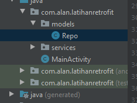
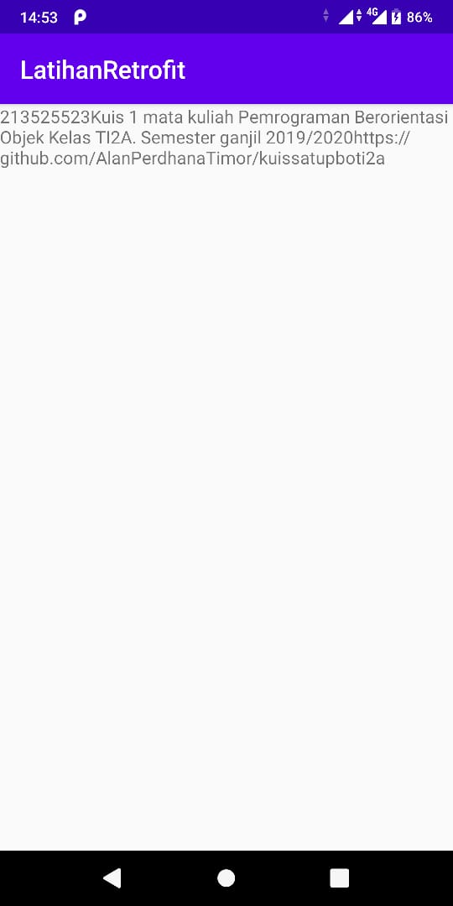

# 13 - Retrofit


## Tujuan Pembelajaran

1. Mahasiswa mampu mengonfigurasi Retrofit pada android;
2. Mahasiswa mampu membuat request ke RESTful API menggunakan Retrofit.

## Hasil Praktikum

1. Silakan buat New Project di Android Studio dengan nama LatihanRetrofit.


2. Tambahkan izin koneksi internet di AndroidManifest.xml
        
     ```java 
            <uses-permission android:name="android.permission.INTERNET"/>
    ````
        


3. Tambahkan dependencies library Retrofit, converter-gson, dan compileOptions.

```java
   implementation 'com.squareup.retrofit2:retrofit:2.9.0'
    implementation 'com.squareup.retrofit2:converter-gson:2.9.0'
```

4. Buatlah package bernama services lalu buat class interface didalamnya.

    ```java
    public interface GitHubService {
    @GET("users/{user}/repos")
    Call<List<Repo>> listRepos(@Path("user") String user);
}
    ```


5. Buatlah package bernama models lalu buat class POJO didalamnya.

    ```java
    public class Repo {
    @SerializedName("id")
    private Integer id;

    @SerializedName("html_url")
    private String htmlUrl;

    @SerializedName("description")
    private String description;

    public Integer getId() { return id;}

    public String getHtmlUrl() {return htmlUrl;}

    public String getDescription() {return description;}
}
    ```

6. Pada class MainActivity, buat request ke REST API

    ```java
    public class MainActivity extends AppCompatActivity {

    @Override
    protected void onCreate(Bundle savedInstanceState) {
        super.onCreate(savedInstanceState);
        ActivityMainBinding binding = DataBindingUtil.setContentView( this, R.layout.activity_main);

        Retrofit retrofit = new Retrofit.Builder()
                .baseUrl("https://api.github.com/")
                .addConverterFactory(GsonConverterFactory.create())
                .build();

        GitHubService service = retrofit.create(GitHubService.class);

        Call<List<Repo>> repos = service.listRepos("AlanPerdhanaTimor");

        repos.enqueue(new Callback<List<Repo>>() {
            @Override
            public void onResponse(Call<List<Repo>> call, Response<List<Repo>> repoList) {
                binding.setRepo(repoList.body().get(0));
            }

            @Override
            public void onFailure(Call<List<Repo>> call, Throwable t) {
                Log.e("Eror", t.getMessage());
            }
        });
    }
}
    ```

   
7. Struktur packages dan class seharusnya seperti pada gambar berikut.

    
 

<br><br>

## Hasil


