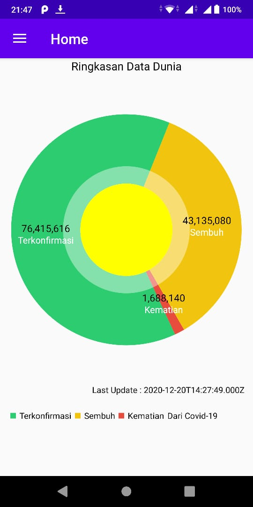
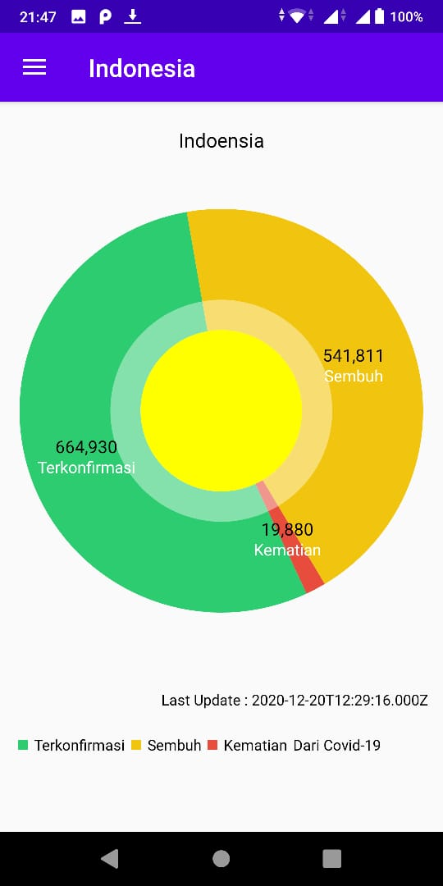
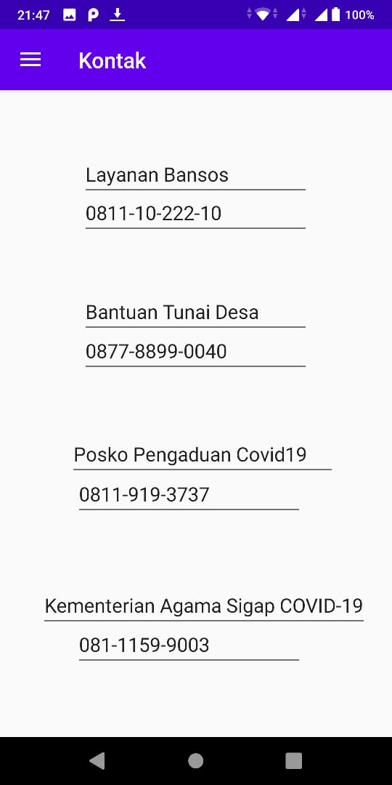
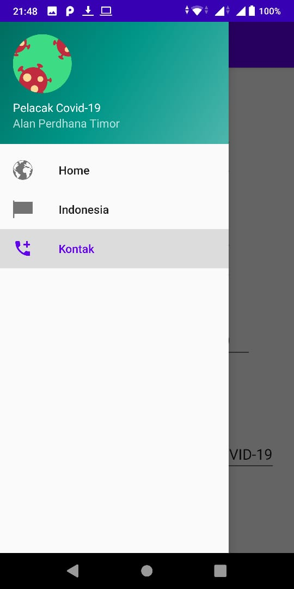

## CVD (Corona Tracking)

    Sebuah Aplikasi Android yang menampilkan data terkini terkait Kasus Corona dengan menggunakan Bahasa Pemrograman Java
    
       ( https://github.com/AlanPerdhanaTimor/mobile-3e-04/tree/master/src )

  

## Deskripsi Aplikasi

    Aplikasi Corona Tracking dibuat bertujuan untuk memberikan informasi terkini terkait kasus corona
    yang sedang melanda dunia

    Aplikasi ini bertujuan untuk memenuhi kriteria tugas akhir mata Kuliah Pemrograman Android 

    Aplikasi ini di buat berdasarkan API yang diambil dari situs dibawah ini:
    https://covid19.mathdro.id/

    Aplikasi ini memanfaatkan koneksi Internet untuk digunakan

    Aplikasi ini berbasis bahasa pemrograman java

## Indentitas Pengembang (Developer)

    Dibuat Oleh :

    Alan Perdhana Timor 
    (1841720187)
    TI-3E

## Fitur-fitur Aplikasi

|  |  |
|--|--|
| Tampilan menu Home : berfungsi menampilkan data kasus corona di seluruh dunia  |   |
| Tampilan menu Indonesia : berfungsi menampilkan data kasus corona di seluruh Indonesia |   |
| Tampilan menu Kontak : berfungsi menampilkan daftar kontak yang bisa dihungi terkait bantuan terhadap corona |      |
| Tampilan Side Menu : berfungsi sebagai navigator antar menu pada aplikasi |      |

## Saran

    1. Menambahkan fitur GPS untuk langsung mengambil data dimana kita sedang berada
    2. Menambahkan fitur history, untuk melihat history kasus corona pada hari-hari sebelumnya
    3. menambahkan beberapa background untuk mempercantik aplikasi

## Kesimpulan

    Pada awal pembuatan aplikasi ini sendiri tidak berjalan lancar sesuai keinginan pengembang, dikarenakan fokus terhadap aplikasi ini terhambat oleh kesibukan lain seperti project mata kuliah lain.

    Adapun beberapa pengetahuan dasar pada yang belum pernah terpelajari untuk diimplementasikan pada project

    Dalam pembuatan aplikasi ini, pengembang berusaha untuk mengimplementasi bab-bab pembelajaran yang telah diberikan  secara universal pada project ini

## Sumber Data/Referensi

    1.  https://developer.android.com/guide/fragments
    2.  https://developer.android.com/guide/navigation
    3.  https://www.codingdemos.com/android-pie-chart-tutorial/
    4.  https://developer.android.com/jetpack/guide
    5.  https://github.com/PhilJay/MPAndroidChart
    6.  https://github.com/AzharRivaldi/Info-COVID-19
    7.  https://www.youtube.com/watch?v=UL504WhDg_g&t=20s
    8.  https://developer.android.com/topic/libraries/data-binding
    9.  https://stackoverflow.com/
    10. https://covid19.mathdro.id/ 
